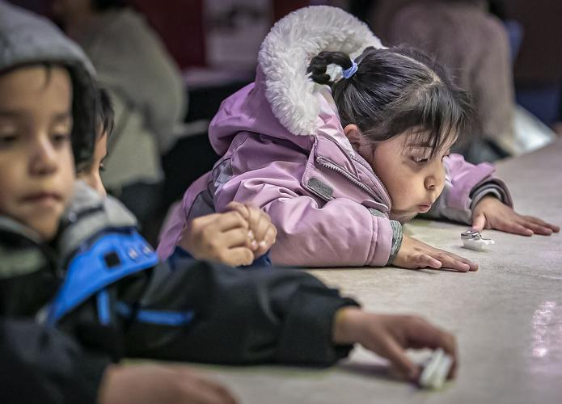

# Creative Technology with and for Resource Constrained Communities

Casey Anderson

---
<!-- paginate: true -->

## Community Partners / Sites

* [Lek&ograve;l Kominote Mat&egrave;nwa](https://www.matenwa.org/): Mat&egrave;nwa, La Gon&acirc;ve, Haiti, Summer 2016 & Summer 2019
* KAOS Network: Leimert Park, Los Angeles, CA, 2021 - present

---

## Lek&ograve;l Kominote Mat&egrave;nwa

---

"Lekòl Kominote Matènwa (often abbreviated as LKM) is a community school in rural Haiti on the island of La Gonâve. LKM’s pedagogical philosophy emphasizes education in collaboration with, and celebration of, local knowledge and traditions."

(from *Repurpose, Remix, Bend: Piloting A Locally Defined Technology Curriculum*, Anderson)

---

I traveled to LKM with my collaborator, [Elizabeth Chin](https://elizabethjchin.com/), July of 2016 and 2019:

"...Over the course of two weeks, we lead training sessions for LKM’s faculty as well as workshops for children. In both cases, our activities at the school functioned as a means to explore what kind of hands-on technology curriculum is possible at LKM while simultaneously navigating the complexities of doing so sustainably in rural Haiti." 

(from *Repurpose, Remix, Bend: Piloting A Locally Defined Technology Curriculum*, Anderson)

---

## Toothbrush Robots

During our Summer 2019 trip we began piloting the toothbrush robot workshop, where participants mount a simple circuit (a coin-cell battery and vibration motor) to a toothbrush with glue or tape. The vibrating motor causes the bristles to move, similar to how an insect walks.

---

Once a participant completes their robot, which takes about 15 minutes, they are encouraged to critically evaluate their design during some light-hearted deployments/activities:

* racing robots
* hosting a robot dance party

---

Due to the light-hearted nature of the activity, and short duration, participants often opt to build a second, more experimental robot. This trend clearly demonstrates that participants have internalized the learning outcomes of this activity and have transitioned to applying it to their own ideas and interests.

---

---

---

---

---

## Outcomes
### Repairs (Literacy)

Participants started bringing broken electrical items from their homes to collaboratively try to repair them during our workshops, clearly demonstrating an increased confidence in their ability to work with technology.

---

## Outcomes
### Inventions

Participants also began designing decorative devices in order to enhance comfort in their classrooms. Here we have a helicopter-room-fan installed in the art classroom by one of our participants.

---

## Outcomes
### Thinking Through Making

Finally, participants discovered new ways to make use of the skills we built our workshops around. Here a teacher shows a model of a house, with working lighting, they would like to live in.

---

# KAOS Network

---

Elizabeth Chin and I had been looking for a local (Los Angeles) site to continue developing our hands-on technology curriculum, due to our inability to return to Haiti since 2019. We connected with Los Angeles-based filmmaker / community organizer Ben Caldwell, who invited us to teach on the sidewalk in front of his Leimert Park community arts center once a week. We have been doing so for three years.

---

### Toothbrush Robots

One day a week we set up two tables full of electronics supplies under a portable tent in front of KAOS Network. Our toothbrush robot activity has become the defining feature of our work in Leimert. When passers-by make eye contact with us we invite them to join us by asking "Want to build a robot?"

---

### 3D Printing & African Masks

One of our collaborators, An Pan (a graduate of the program Elizabeth and I teach in at **ArtCenter College of Design**), introduced a number of popular activities requiring the use of a 3D Pen, or a 3D Printer in a handheld form factor.

---

### 3D Printing & Adinkra Symbols

Experiments with the 3D Pen lead to new activities that community members helped pilot. A coloring book of Adinkra (West African) symbols, and a collection of mask templates, have become popular avenues for 3D Pen exploration.

---

## Outcomes
### Mashups

Participants often combine multiple activities into a new kind of hybrid activity. For example: decorating their toothbrush robots with the 3D Pen. We see this participant driven creation as a key sign of success.

---

## Outcomes
### Technology Literacy

Something something not sure what to say about this

---

## Outcomes
### KAOS Kids

Kaos Kids is an Afrofuturist culture school that holds free, drop-in educational activities for Leimert Park Village youth and their families. Participants flock weekly to our activation site, the sidewalk in front of KAOS Network, to learn chess, cultivate technology skills (electronics and VR), play games, and deepen their connection to their community. KAOS Kids participants leave our activations inspired to continue leveraging their creativity to pursue new ideas and contribute to the neighborhood

---

